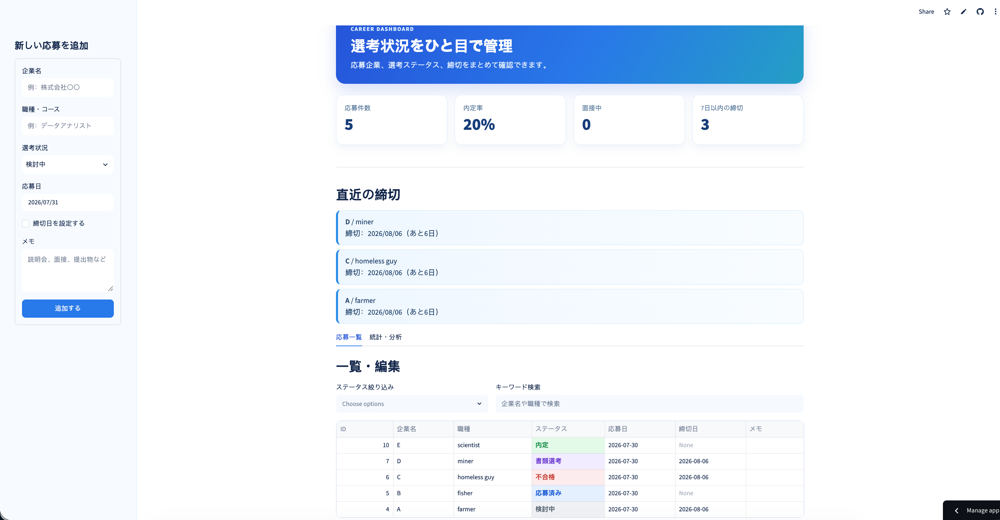

# Job Tracker

[](https://github.com/cogitoVinci/job-tracker/actions/workflows/ci.yml)

就活の管理をExcelでしていた時、締切を見逃しそうになったので作りました。  
企業名・職種・選考状況・応募日・締切日をまとめて管理できるWebアプリです。

## 公開アプリ

https://job-tracker-kuqvenpdwjb9hnv4fkqzht.streamlit.app/

※公開版は、アプリが再起動されるとデータが消えることがあります。ローカルで使う場合は消えません。

## できること

一覧表示、編集、削除のほか、締切が近い応募を一目で確認できるようにしています。  
選考状況ごとの件数や内定率も確認できるので、就活の進み具合が分かりやすくなります。

- 企業・職種・選考状況の登録、編集、削除
- 7日以内の締切の表示
- 企業名・職種での検索
- ステータスによる絞り込み
- 応募件数・内定率の集計
- 選考状況と月別応募件数のグラフ表示
- CSVファイルのダウンロード
- SQLiteによるデータ保存

## 選考状況のステータス

`検討中` → `ES` → `適性検査` → `面接` → `内定` / `不合格` / `辞退`

`検討中`はまだ応募していない会社なので、応募件数には含めていません。

## 使い方

1. 左側のフォームに企業名・職種・選考状況・日付を入力します。
2. 必要な場合はメモを書きます。
3. 「追加する」を押して保存します。
4. 応募一覧から検索・編集・削除ができます。
5. 「統計・分析」タブで応募状況を確認できます。

## 画面



## 必要なもの

- Python 3.13
- uv

## インストール方法

```bash
git clone https://github.com/cogitoVinci/job-tracker.git
cd job-tracker
uv sync
```

## 起動方法

```bash
uv run streamlit run main.py
```

起動した後、ブラウザで次のURLを開きます。

```text
http://localhost:8501
```

## テスト

```bash
uv run pytest
```

テストでは、主にデータベースの処理と集計の処理を確認しています。

GitHubにpushすると、GitHub Actionsでも自動でテストが実行されます。

## 使用した技術

- Python
- Streamlit
- SQLite
- pandas
- pytest
- GitHub Actions
- uv

## ライセンス

MIT Licenseを使っています。  
詳しくは[LICENSE](LICENSE)を確認してください。
